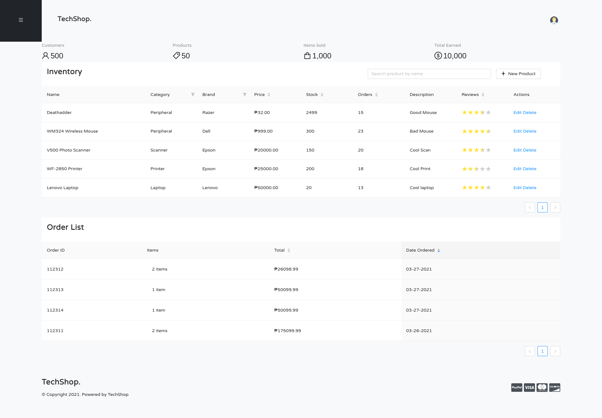
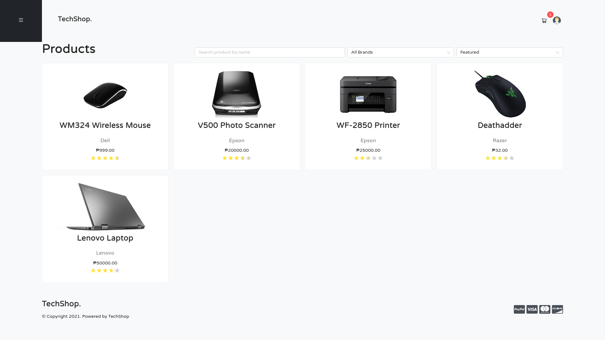
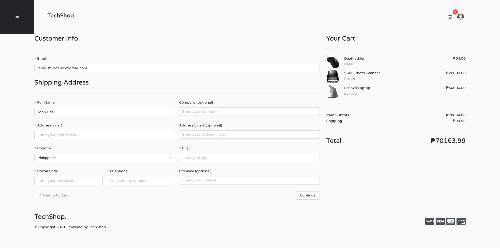
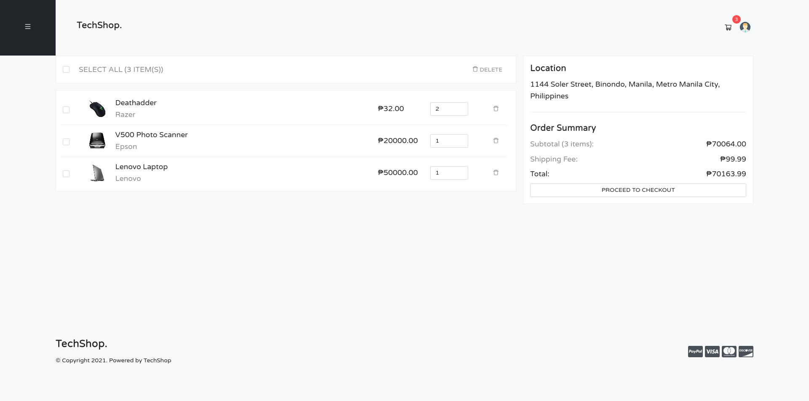
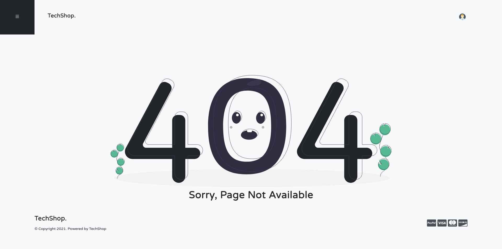

# CCAPDEV MCO: Web Application
## Concept:
The concept is an Online Computer Store where there are 2 users who can access the website, namely the buyers and the seller. 
There is only 1 seller but for the convenience of the seller, a dashboard was made for the seller to add products, restock products, 
and many more. Buyers can buy products by adding these products to their cart and checking it out. We focused on the category of Computer, 
with subcategories of Laptops, Monitors, Data Storage, Peripherals, Networking, Printer and Scanner.

## Instruction to run and view the built website:
Assuming the you have already cloned the repository, do the following:
1. Enter the command `cd server`.
2. Enter the command `npm i`.
3. To insert the default data, enter the command `npm run insert_data`.
4. Press CTRL + C to stop the command since it doesn't automatically end.
5. Enter the command `npm run start`
6. On your preferred browser, input `http://localhost:3000/` as the url and you should see the website

## Default Credentials
| username      | password   |
| ------------- | ---------- |
| buyer         | buyerpass  |
| seller        | sellerpass |
| sweetgirl123  | lksad      |
| xXbatmanXx143 | qweqasd    |
| coolkidXD     | axzcas     |

## Features:
- Has Buyer and Seller Roles
  - Buyer can:
    - view products which they can buy
      - searchable by name
      - sortable by popularity and price
      - filterable by category
    - add those products to their cart
    - checkout
    - view product rating
    - view order history
  - Seller can:
    - add products to be sold
    - view item stock
    - view order list
- Landing Page
- Login and Logout
- View, Edit and Delete Profile

## Screenshots
### Landing Page

### Seller Dashboard

### Product Catalog

### Cart

### Checkout

### Page Not Found

## Credits

## Author(s)
- 
- 
- 